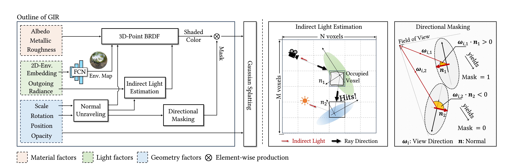

<div align="center">

# [T-PAMI🔥] Gir: 3d gaussian inverse rendering for relightable scene factorization  

[](https://arxiv.org/abs/2312.05133)
[](https://3dgir.github.io/)
    
[Yahao Shi](https://scholar.google.com/citations?user=-VJZrUkAAAAJ&hl=en)<sup>1</sup>
[Yanmin Wu](https://yanmin-wu.github.io/)<sup>2</sup>
[Chenming Wu](https://chenming-wu.github.io/)<sup>3</sup>
[Xing Liu](https://scholar.google.com/citations?user=bdVU63IAAAAJ&hl=en)<sup>3</sup>
[Chen Zhao](https://scholar.google.com/citations?hl=en&user=kWzyOa8AAAAJ)<sup>3</sup>
[Haocheng Feng](https://scholar.google.com.hk/citations?user=pnuQ5UsAAAAJ&hl=zh-CN&oi=ao)<sup>3</sup>
[Jian Zhang](https://jianzhang.tech/)<sup>2</sup> 
<br>
[Bin Zhou](http://scholar.google.com/citations?user=tG4RnyYAAAAJ&hl=en&oi=ao)<sup>1</sup>
[Errui Ding](https://scholar.google.com/citations?user=1wzEtxcAAAAJ&hl=zh-CN)<sup>3</sup>
[Jingdong Wang](https://jingdongwang2017.github.io/)<sup>3</sup>
    
<sup>1</sup> Beihang University, <sup>2</sup> Peking University, <sup>3</sup> Baidu VIS
    
</div>
    
---
    
Official implementation of "GIR: 3D Gaussian Inverse Rendering for Relightable Scene Factorization".
    
## 🛠️ Pipeline
<div align="center">
  
</div><br/>
    
---
    
    

## 0. Installation

The installation of GIR is similar to [3D Gaussian Splatting](https://github.com/graphdeco-inria/gaussian-splatting).
```
# Clone the Repository
git clone https://github.com/guduxiaolang/GIR.git

# Create the environment
conda create -n gir python=3.7
conda activate gir
 
# Install the dependencies
pip install -r requirements.txt
pip install torch==1.12.1+cu116 torchvision==0.13.1+cu116 torchaudio==0.12.1 --extra-index-url https://download.pytorch.org/whl/cu116
pip install -e submodules/diff-gaussian-rasterization
pip install -e submodules/simple-knn
pip install -e submodules/envlight
pip install tqdm plyfile 
    
# Load HDR images correctly 
pip install imageio[full]
```
---
    
## 1. Data preparation
The files are as follows:

Blender Dataset
```
[DATA_ROOT]
|---test
|   |---<image 0>
|   |---<image 1>
|   |---...
|---train
|   |---<image 0>
|   |---<image 1>
|   |---...
|---transforms_test.json
|---transforms_train.json
```  
COLMAP Dataset 
```
[DATA_ROOT] 
|---images
|   |---<image 0>
|   |---<image 1>
|   |---...
|---sparse
    |---0
        |---cameras.bin
        |---images.bin
        |---points3D.bin
```

---

## 2. Training and Evalution
The training and evaluation commands for each dataset are provided in the shell scripts located in the `scripts` folder.
    
The basic training and testing commands are shown below.
    
```
# training
python train.py -s $data_dir --eval --port $port_num --random_background --hdr_rotation
    
# rendering
python render.py -m $model_dir --skip_train --save_name "render" -w --hdr_rotation
    
# relighting
python render.py -m $model_dir --skip_train --save_name ${hdr_list_name%.*} -w --hdr_rotation --environment_texture $hdr_dir --render_relight
```
    

---

## 3. Acknowledgements
We are quite grateful for [3DGS](https://github.com/graphdeco-inria/gaussian-splatting), [NeRO](https://github.com/liuyuan-pal/NeRO), and [Filament](https://google.github.io/filament/Filament.html)

---